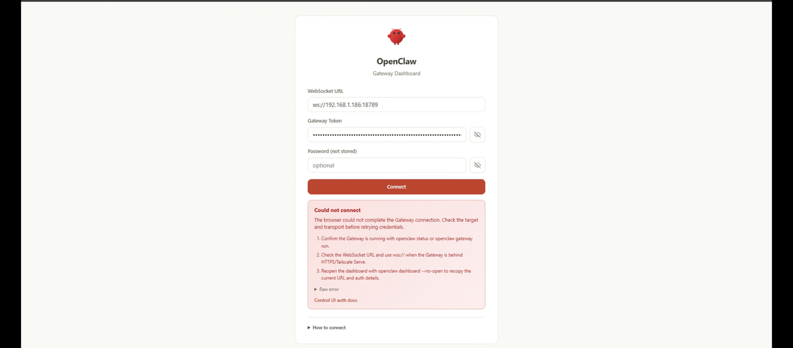

# 🦞 **openclaw-vm**
### _Automatic OpenClaw-Ready Ubuntu VM Installer for Proxmox VE_
Created by **Wesley Faulkner**

**Current release: [v1.3.2](https://github.com/wesley83/proxmox-openclaw-vm/releases/tag/v1.3.2)** — see [CHANGELOG.md](CHANGELOG.md) for release history.

**Jump to:** [Install](#-one-liner-install) · [Requirements](#-requirements) · [Options](#-options) · [After the script finishes](#-after-the-script-finishes) · [Accessing the Control UI](#4-access-the-control-ui) · [Troubleshooting](#-troubleshooting) · [Security](#-security--read-before-exposing-the-gateway)

> **Two things that trip up most first runs**, both covered below:
> 1. **Snippets storage must be enabled once** in the Proxmox GUI, or the script fails immediately — [how](#enable-snippets-required-once).
> 2. **`http://<vm-ip>:18789` will never load the Control UI**, no matter how correct your token is. That is by design, not a bug in this script — [why, and the four things that do work](#4-access-the-control-ui).

---

## 🚀 Overview

`openclaw-vm.sh` is a one-command installer that creates a fully configured **Ubuntu VM** on **Proxmox VE** and automatically installs:

- 🟢 **Node.js** (from NodeSource — version-verified against OpenClaw's minimums)
- 🦞 **OpenClaw** ([openclaw/openclaw](https://github.com/openclaw/openclaw)) — the personal AI assistant, at `latest` or a version you pin
- 🔐 SSH access for a customizable user (default: `openclaw`)
- ⏱️ **systemd lingering**, so the gateway daemon survives logout and starts at boot
- 🎟️ A pre-generated gateway auth token (created *inside* the VM, never in host logs)
- 📦 Cloud-init provisioning + QEMU Guest Agent
- 📝 Logging, status reporting, and error handling

**No template VM required** — the script downloads the official Ubuntu Cloud Image and builds everything from scratch.

> **Onboarding is deliberately NOT automated.** No LLM API key is ever handled by this script, so no secret can land in the Proxmox host log. The script finishes by printing the exact commands to complete setup over SSH.

---

## ⚠️ Status

**Run end to end on real Proxmox VE hardware (PVE 7), including onboarding.** In July 2026, against `openclaw 2026.7.1-2`, a full run on a `local-lvm` + directory-snippet-storage node completed: disk import/resize on thin-LVM, cloud-init, Node v26.5.1, gateway token generated, provisioning confirmed via QEMU Guest Agent — exit 0. Onboarding was then completed interactively (LLM provider, messaging channel, web search), the gateway daemon was enabled and started as a systemd user service, and the Control UI was reached successfully through an SSH tunnel. Everything in [After the Script Finishes](#-after-the-script-finishes) is written from that run, including the Control UI secure-context problem in step 4 — which is documented here because it was hit for real, not anticipated.

**What v1.3.0 changed has *not* been re-run on hardware.** The `--openclaw-version` flag and the rewritten post-install instructions were verified against a live OpenClaw 2026.9.1 install, by generating the cloud-init user-data and validating it against cloud-init 26.1's own schema checker, and by host-side dry runs of the argument parsing and the guest script's argument plumbing. That is real evidence, but it is weaker than a provisioning run — see [Known Limitations](#-known-limitations).

---

## 🧩 One-liner Install

Run this directly on any **Proxmox VE node** as **root**:

```bash
bash -c "$(curl -fsSL https://raw.githubusercontent.com/wesley83/proxmox-openclaw-vm/main/openclaw-vm.sh)"
```

Pass flags after `--`:

```bash
bash -c "$(curl -fsSL https://raw.githubusercontent.com/wesley83/proxmox-openclaw-vm/main/openclaw-vm.sh)" -- --memory 16384 --cores 8
```

Or clone and run locally — recommended for a first run, since `--debug` output goes to the log:

```bash
git clone https://github.com/wesley83/proxmox-openclaw-vm.git
cd proxmox-openclaw-vm
bash openclaw-vm.sh --debug
```

The script will:

- Detect storage, snippet storage, bridge, SSH keys, and the next free VMID
- Download and verify the Ubuntu cloud image
- Create the VM, import and resize the disk
- Provision Node.js + OpenClaw via cloud-init
- Poll provisioning status via the QEMU Guest Agent
- Print your onboarding instructions

---

## 🧰 Requirements

| Requirement | Description |
|------------|-------------|
| Proxmox VE 7/8/9 | Runs directly on a node (not inside a VM) |
| Snippets storage | A storage with **Snippets** content enabled *(once only — see below)* |
| SSH key | `/root/.ssh/id_ed25519.pub` or `id_rsa.pub` **on the Proxmox node** (or pass `--ssh-key`). This is the node's own key, not your desktop's — see the note below |
| `qm`, `pvesh`, `pvesm`, `curl`, `qemu-img`, `ip`, `awk` | Pre-installed on Proxmox; verified by the script |
| Free space | ~10 G on the target storage. Provisioning writes roughly 5 G (cloud image + apt + Node + OpenClaw); the rest is headroom for the npm cache, logs, and state. The script warns before downloading anything if the storage reports less |
| Staging space | ~2 G free in `/tmp` on the node — the cloud image is downloaded there before import. Set `TMPDIR=/path` to stage it elsewhere if `/` is a small LV |
| Host RAM | Enough free memory for `--memory` (default `8192` MB). Overcommit is allowed and only warned about, but a VM the node cannot fit will fail to start |
| `python3` | Optional but recommended — used for JSON parsing, with fallbacks throughout |
| Network access | `cloud-images.ubuntu.com` and `api.launchpad.net` (host); `archive.ubuntu.com`/`security.ubuntu.com` or your apt mirror, `deb.nodesource.com`, and the npm registry (guest). On an egress-filtered network, blocking the apt mirrors fails provisioning *and* blanks QGA status polling, since `qemu-guest-agent` is one of the apt packages |

### Enable Snippets (Required Once)

Proxmox GUI →
**Datacenter → Storage → local → Edit → Check `Snippets` → Save**

This is the most common reason a first run fails immediately.

---

## ⚙️ Options

| Flag | Meaning | Default |
|------|---------|---------|
| `-m`, `--memory <MB>` | VM RAM. Minimum `2048`, warns below `4096` | `8192` |
| `-c`, `--cores <N>` | CPU cores (≥ 1). Warns if it exceeds the node's CPU threads | `4` |
| `-d`, `--disk <SIZE>` | Disk size with suffix. Minimum `8G`, warns below `20G`; must also exceed the image's ~3.5 GiB virtual size, since `qm resize` cannot shrink | `40G` |
| `-s`, `--swap <SIZE>` | Swapfile size, or `0` to disable. Cloud images ship with **no swap** | `2G` |
| `-u`, `--ubuntu <codename>` | Ubuntu codename (`resolute`, `noble`, `jammy`, …) | latest active LTS (auto-detected; falls back to `noble`) |
| `-n`, `--node <major>` | Node.js major version | `26` (supported: `22 24 25 26`) |
| `--openclaw-version <v>` | OpenClaw npm version or dist-tag. Pin it (e.g. `2026.9.1`) for reproducible builds — OpenClaw ships often and `latest` means two VMs built months apart get different software. Not validated against the registry, so a typo only surfaces once the VM is up | `latest` |
| `--user <name>` | VM username (lowercase, starts with a–z or `_`, ≤ 32 chars) | `openclaw` |
| `--storage <id>` | Proxmox storage for the VM disk | `local-lvm` if present, else first active storage with `images` content |
| `--ssh-key <path>` | SSH public key file (must end in `.pub`; multiple keys supported) | `/root/.ssh/id_ed25519.pub` (or `id_rsa.pub`) |
| `--debug` | Enable bash debug tracing (`set -x`) | off |
| `-h`, `--help` | Show help and exit | — |

### Example

```bash
bash openclaw-vm.sh --memory 16384 --cores 8 --disk 80G --node 24 --user assistant
```

Or pin OpenClaw for a reproducible build:

```bash
bash openclaw-vm.sh --openclaw-version 2026.9.1
```

---

## 🔐 Default VM Configuration

| Setting | Value |
|---------|-------|
| OS | Ubuntu Cloud Image (latest LTS, auto-detected) |
| User | `openclaw` (customizable via `--user`), passwordless sudo |
| Auth | Your root SSH public key; random initial console password printed in the summary |
| Hostname | `openclaw-<VMID>` (also what appears in DHCP leases) |
| Network | DHCP via `vmbr0` (or first available bridge) |
| CPU / Machine | `host` / `q35` |
| Autostart | `--onboot 1` — this is an always-on assistant |
| Guest Agent | Installed and started (used for status polling and IP detection) |
| Node.js | NodeSource, version-verified against OpenClaw's minimums |
| Build toolchain | `build-essential python3 cmake` — matches what OpenClaw's own `install.sh` installs on Debian/Ubuntu |
| OpenClaw | `npm install -g openclaw@latest` — pin a version with `--openclaw-version` |
| Gateway port | `18789` (not yet listening — set during onboarding) |

### Why `cmake` is pre-installed

OpenClaw's main native dependencies (`@lydell/node-pty`, `sqlite-vec`) ship per-platform **prebuilt** binaries, so a normal install compiles nothing. But when a prebuild is missing for the running Node ABI or architecture, npm falls back to building from source, which needs `cmake`.

Upstream's `install.sh` handles this two ways: it installs `build-essential python3 make g++ cmake` unconditionally on Linux, *and* it greps failed npm logs for `cmake: command not found` / `Failed to build llama.cpp` to install the toolchain and retry. This script calls `npm` directly rather than going through `install.sh`, so it gets neither remedy — pre-installing the toolchain is what keeps that fallback from becoming an unrecoverable provisioning failure.

### Resource sizing

Measured footprint, so you can size deliberately rather than guess:

| Component | Disk |
|---|---|
| Ubuntu cloud image, booted | ~2.2 G |
| apt packages, all 10 incl. `build-essential` + `cmake` toolchain (**measured**, unchanged as of OpenClaw 2026.9.1) | 645 M |
| Node.js (NodeSource) + OpenClaw incl. dependency trees and npm cache (**measured on 2026.7.1-2** — see the row below; treat this as a floor, not a current figure) | 778 M |
| OpenClaw's own installed package alone (**measured on 2026.9.1**) — it roughly doubled since 2026.7.1-2, which is what makes the row above understated | 520 M |
| **With headroom for logs, state, and updates** | **~5 G is still a comfortable planning number** — the `20G`+ recommendation absorbs this growth easily |

OpenClaw's footprint has grown fast between releases, so treat these as a floor and re-measure if you are sizing tightly. Pinning `--openclaw-version` keeps a given VM's footprint predictable.

Hence the `8G` hard floor and `20G` warning. The `40G` default leaves room for logs, state, conversation history, and a browser later.

**Swap:** Ubuntu cloud images ship with **zero** swap, which makes a memory spike an instant OOM-kill rather than a slowdown. The script adds a `2G` swapfile via cloud-init's `mounts` module. Ordering was verified against the real module list: `growpart` → `resizefs` → `mounts` all run in the `cloud_init` stage, *before* `package_update_upgrade_install` and `runcmd` in `cloud_final` — so the disk is already grown and swap is already active during the apt and npm installs, which are the actual memory spikes. Disable with `--swap 0`.

**Disk growth** is automatic: `growpart` and `resizefs` are image-level cloud-init modules, so they still run even though `--cicustom` replaces the user-data.

### Browser automation is *not* included

Nothing here downloads a browser. `openclaw` depends on `playwright-core`, which does **not** fetch Chromium at install time, and upstream's `install.sh` contains no browser handling at all. If you enable browser automation later, budget for installing a browser and its system libraries yourself — the default `40G` disk and `8192` MB RAM leave headroom for it.

---

## 🏁 After the Script Finishes

The script installs OpenClaw but does **not** onboard it. Finish over SSH:

### 1. Connect

```bash
ssh <user>@<vm-ip>
```

> **Run this from the Proxmox node, not your desktop** — the embedded key is `/root/.ssh/id_ed25519.pub` (or `id_rsa.pub`) **on the node**, so only the node's own key is authorized. Connecting from elsewhere fails with `Permission denied (publickey)` before any password prompt even appears. To connect directly from your own machine going forward, add its public key to `~/.ssh/authorized_keys` on the VM (or re-run with `--ssh-key` pointing at a file containing both keys, one per line — multiple keys are supported), once you're in via the node.

> **First login forces a password change.** Have the console password from the summary ready — PAM asks for it as the "current" password even with SSH key auth.

### 2. Onboard

```bash
openclaw onboard --install-daemon --gateway-token "$(cat ~/.openclaw/gateway-token)"
```

This one command runs an interactive wizard with several prompts. Expect, roughly in this order:

> The wizard's exact prompts and wording change between OpenClaw releases. What follows describes its **shape** as of 2026.9.1, not a screen-by-screen script — if your version asks something different, answer it and carry on.

**a. A security disclaimer** you must accept before anything else happens. It summarizes the personal-agent trust model and asks `Continue?`, with `Yes` preselected — press **Enter**. This is a single-operator VM you provisioned yourself, so the default posture applies; choosing `No` exits without configuring anything.

**b. LLM provider selection and auth** — OpenAI, Anthropic, xAI, Google, OpenRouter, or others; sign in or paste an API key here.

**c. Messaging channel selection** — Telegram, WhatsApp, Slack, Discord, etc. Pick whichever you'll actually talk to the agent through; none is required by this script.

**d. Web search provider selection**, after which workspace/Gateway/session setup runs automatically.

**e. A first-chat session.** OpenClaw's docs describe this as opening the Control UI in a browser (or printing its URL on headless systems) — but on a VM with no browser installed, it drops into a local terminal chat instead, with the freshly-created agent introducing itself and asking to be named. That's the `--tui` path ("the terminal hatch"), and on a headless VM it's what you get.

This step is cosmetic, not structural — your provider, channel, and web-search choices are already saved by this point, and per OpenClaw's docs "workspace and Gateway settings remain untouched" by it. Three ways past it:

- **Skip it up front (cleanest).** Add `--skip-ui` to the onboard command above and this step never runs.

- **Answer it and move on.** Type anything and press Enter — e.g. *"Surprise me — pick a name, creature, and emoji you like. Keep it short."* It may reply once or twice more.

- **Bail out.** Press **Ctrl+C** (or Ctrl+D) to return to the shell. If you're in the Proxmox web console and it doesn't respond, click into the terminal pane first so it has focus.

Either way, you end up back at a shell prompt, ready for step 3.

> **About the token.** On **2026.9.1** this works as written: we re-verified live (non-interactive, root and non-root) that `--gateway-token` lands in `gateway.auth.token` exactly as passed. On **2026.7.1-2** it did **not** — the default onboarding flow silently ignored both `--gateway-token` and `--gateway-bind`, minting its own token instead. That matters if you pinned an older release with `--openclaw-version`, since pinning back reintroduces the bug.
>
> Either way, the value that actually counts afterward is `gateway.auth.token` in `~/.openclaw/openclaw.json` — not the file. Step 3 shows you how to check which one is live and how to force them into sync if they disagree.
>
> Don't pass `--gateway-bind` here even though it now works: step 4 keeps the gateway on `loopback`, which is what the Control UI's secure-context requirement needs.

### 3. Start the gateway

Everything up to this point has only *installed and configured* OpenClaw — nothing is actually listening yet. The Control UI and gateway API don't exist as a running process until this step. Run it after the onboarding wizard above has returned control of the terminal (exit the first-chat session first if you're still in it):

```bash
export XDG_RUNTIME_DIR=/run/user/$(id -u)
systemctl --user enable --now openclaw-gateway.service
openclaw gateway status --require-rpc
```

What each line does, and why it matters:

- **`export XDG_RUNTIME_DIR=/run/user/$(id -u)`** — `systemctl --user` needs to know where your personal systemd instance and its D-Bus session socket live, normally `/run/user/<your-numeric-uid>`. A full desktop login sets this automatically; an SSH or console session — especially right after first boot — often doesn't. `id -u` looks up your UID (for the `openclaw` user) so this works regardless of what number it actually is. Skip it and the next line typically fails with something like `Failed to connect to bus: No such file or directory`.

- **`systemctl --user enable --now openclaw-gateway.service`** — `--install-daemon` (back in step 2) only created the *unit file*; this is what actually runs it. `enable` registers it to start automatically on every future boot; `--now` also starts it immediately, in this session, without waiting for a reboot. Combined with the systemd lingering the provisioning script already turned on for this user, this is what makes OpenClaw an always-on service — running now, and still running after you log out, reboot the VM, or it crashes and gets restarted — rather than something tied to your SSH session staying open.

- **`openclaw gateway status --require-rpc`** — a read-only check: confirms the systemd unit is actually active, and does a connectivity/auth probe against the gateway's WebSocket port to verify your token is recognized. This is what tells you the previous line actually worked, before you go looking for the Control UI in a browser and wonder why it won't load. `--require-rpc` makes it **exit non-zero when that probe fails**, instead of printing a problem and still returning success — so it works in a `&&` chain or a script. Add `--json` if you want to parse it.

**Then confirm your known token is the one actually configured** (see the note in step 2 — this matters on some OpenClaw versions, not others, so just always check). On 2026.9.1+ you can simply look:

```bash
openclaw gateway auth-token --show
```

That prints the token the gateway is actually using — compare it to `cat ~/.openclaw/gateway-token`. It only prints to an interactive terminal, so it won't leak into a pipe or a log. If they don't match, or your version doesn't have that command, force them into sync:

```bash
openclaw config set gateway.auth.token "$(cat ~/.openclaw/gateway-token)"
openclaw gateway restart
openclaw gateway status --require-rpc
```

Both are safe and idempotent. OpenClaw also ships its own repair for a missing or broken token — `openclaw doctor --fix --generate-gateway-token` — but note that **generates a new token** rather than adopting the one in your file, so prefer the `config set` line above if you want the file to stay authoritative.

Use `gateway restart`, not a `gateway stop` + `gateway start` chain — OpenClaw's docs explicitly warn against substituting one for the other. Leave `bind` on its `loopback` default: as the next step explains, opening the port to the LAN doesn't get a browser into the Control UI anyway, and every recommended access path works with loopback.

### 4. Access the Control UI

**You cannot browse to `http://<vm-ip>:18789` — by design, not misconfiguration.** The Control UI creates a cryptographic *device identity* in your browser, which requires a [secure context](https://developer.mozilla.org/en-US/docs/Web/Security/Secure_Contexts) — **HTTPS or localhost**. Plain HTTP to a LAN IP is neither, so the gateway rejects the WebSocket no matter how correct your token is. This is exactly what that failure looks like — a valid, masked token entered correctly, same "Could not connect" every time:



The three numbered hints in that box are generic and won't fix this specific case (the URL/transport and token are already right) — the real cause only shows up in the "Raw error" expander or the server log; see Troubleshooting. Skip straight to one of these instead:

#### Option A — SSH tunnel (zero extra software; start here)

From the machine whose browser you'll use (requires your key in the VM's `authorized_keys` — see step 1):

```bash
ssh -N -L 18789:127.0.0.1:18789 <user>@<vm-ip>
```

Leave that running — no output is normal — then open **`http://localhost:18789/`** and paste the token from `~/.openclaw/gateway-token` into the Gateway Token field, or append it: `http://localhost:18789/#token=<token>`. `localhost` is a secure context, so this works over plain HTTP.

**Two commands that save guessing:**

```bash
openclaw dashboard --no-open              # on the VM: prints the URL, token included
openclaw gateway probe --ssh <user>@<vm-ip>   # from your machine: tests the tunnel
```

`dashboard --no-open` builds the Control UI URL with the live token so you don't assemble a `#token=` fragment by hand (`--no-open` stops it launching a browser the VM doesn't have; `--json` returns the parts separately). Copy it over, swapping the host for `localhost` while the tunnel is up.

`gateway probe --ssh` reports reachability *and* whether auth was accepted — which is the difference between "my tunnel is broken" and "my token is wrong", two failures that look identical in the browser.

#### Option B — Tailscale Serve (HTTPS inside your tailnet, no port exposure)

This is the method OpenClaw's own docs recommend. [Install Tailscale](https://tailscale.com/download/linux) in the VM (`tailscale up`), then:

```bash
openclaw config set gateway.tailscale.mode serve
openclaw gateway restart
```

The gateway stays on loopback; Tailscale terminates HTTPS and serves it at `https://<vm-magicdns-name>/` to your tailnet only. Any device on your tailnet gets the Control UI with a valid secure context and no tunnel commands.

#### Option C — Cloudflare Tunnel (HTTPS on your own domain)

> Not covered by OpenClaw's docs — this is standard `cloudflared` practice applied to the gateway, tested against the same loopback + token setup as above.

In the [Cloudflare Zero Trust dashboard](https://one.dash.cloudflare.com): **Networks → Tunnels → Create a tunnel**, name it (e.g. `openclaw`), and copy the connector install command it generates. Run that in the VM — it installs `cloudflared` as a service with the tunnel credentials baked in. Then add a **Public Hostname** to the tunnel: `openclaw.yourdomain.com` → service `http://localhost:18789`.

Browse to `https://openclaw.yourdomain.com/` — HTTPS at Cloudflare's edge satisfies the secure context, `cloudflared` proxies (WebSockets included) to the loopback gateway, and token auth still gates every connection.

**Do not stop at token auth here.** Unlike A and B, this puts the gateway on a public hostname reachable by the whole internet. Put a [Cloudflare Access](https://developers.cloudflare.com/cloudflare-one/policies/access/) application in front of the hostname (email OTP or your IdP) so unauthenticated visitors never reach the gateway at all — the token then becomes your second layer, not your only one.

#### Option D — nginx + self-signed TLS (one persistent LAN URL, no client-side setup)

> Not covered by OpenClaw's docs or by this script — a standard nginx-as-TLS-terminator pattern applied to the loopback-bound gateway. Unlike A–C, there's nothing to run or keep open on the *client* side: once set up, `https://<vm-ip>/` just works from any device on your LAN, indefinitely. The tradeoff is a one-time "this certificate isn't trusted" browser warning (it's self-signed) and no access-control layer beyond the gateway token — closer in risk profile to `bind=lan` than to Tailscale or Cloudflare Access.

In the VM:

```bash
sudo apt-get install -y nginx
sudo mkdir -p /etc/nginx/ssl
sudo openssl req -x509 -nodes -days 3650 -newkey rsa:2048 \
  -keyout /etc/nginx/ssl/openclaw.key \
  -out /etc/nginx/ssl/openclaw.crt \
  -subj "/CN=openclaw"
sudo chmod 600 /etc/nginx/ssl/openclaw.key
```

Then write `/etc/nginx/sites-available/openclaw`:

```nginx
server {
    listen 443 ssl default_server;
    listen [::]:443 ssl default_server;
    server_name _;

    ssl_certificate     /etc/nginx/ssl/openclaw.crt;
    ssl_certificate_key /etc/nginx/ssl/openclaw.key;
    ssl_protocols       TLSv1.2 TLSv1.3;
    ssl_ciphers         HIGH:!aNULL:!MD5;

    location / {
        proxy_pass http://127.0.0.1:18789;
        proxy_http_version 1.1;
        proxy_set_header Upgrade $http_upgrade;
        proxy_set_header Connection "upgrade";
        proxy_set_header Host $host;
        proxy_read_timeout 86400s;
    }
}
```

```bash
sudo rm -f /etc/nginx/sites-enabled/default
sudo ln -sf /etc/nginx/sites-available/openclaw /etc/nginx/sites-enabled/openclaw
sudo nginx -t && sudo systemctl reload nginx
```

Browse to `https://<vm-ip>/` (accept the self-signed cert warning once), paste the token, connect. The gateway itself never leaves loopback — nginx is what's reachable on the LAN, on 443, not 18789. If you have a real domain pointed at this VM, swap the two `openssl`-generated files for a Let's Encrypt certificate instead (`sudo apt-get install -y certbot python3-certbot-nginx && sudo certbot --nginx`) and lose the browser warning entirely.

This is a LAN-wide HTTPS port, not a tunnel — apply the same care as `bind=lan`: this script doesn't configure a firewall, so restrict 443 to the hosts that actually need it rather than leaving it open to your whole network.

#### What `bind=lan` is actually for

Only **non-browser** clients: native OpenClaw apps pointing at `ws://<vm-ip>:18789`, or a reverse proxy running on a *different* host. If you need that: `openclaw config set gateway.bind lan && openclaw gateway restart` — the fail-closed token requirement stays in force. It will never make `http://<vm-ip>:18789` work in a browser.

#### Day-to-day references

- **Logs:** `journalctl --user -u openclaw-gateway -f` (file log path shown in `gateway status`)
- **Config:** `~/.openclaw/openclaw.json`
- **Status:** `openclaw gateway status --require-rpc`
- **Health:** `openclaw doctor --lint`
- **Token:** `openclaw gateway auth-token --show`

---

## ✅ Post-Install Verification

Run these **on the Proxmox node** — note they use the guest agent, not SSH:

```bash
# 1. VM is running
qm status <VMID>

# 2. Provisioning succeeded (prints installed versions)
#    This is where you confirm --openclaw-version took effect:
#    it reports the RESOLVED version, e.g. node=v26.5.1 openclaw=2026.9.1
qm guest exec <VMID> -- cat /var/log/openclaw-install.ok

# 3. Full provisioning log
qm guest exec <VMID> -- tail -n 40 /var/log/openclaw-provision.log

# 4. Cloud-init finished cleanly
qm guest exec <VMID> -- cloud-init status --long
```

### Exit codes

| Code | Meaning |
|------|---------|
| `0` | Provisioning confirmed OK |
| `1` | Setup failed before provisioning began (anywhere up through VM start) — the VM, if it existed, is auto-destroyed. The host log always remains, and the cloud-init snippet remains if it was already written |
| `2` | VM created and **deliberately kept**, but provisioning failed or went unconfirmed |
| `130` / `143` | Interrupted by SIGINT (Ctrl-C) or SIGTERM. The VM is destroyed unless it had already been kept |

Exit `2` is not a crash. It exists so scripted callers see a non-zero status while the VM survives for inspection.

**These are the only codes the script emits.** Several `qm` calls are intentionally unguarded, and under `set -e` they would otherwise propagate the tool's own status — a full LVM-thin pool makes `qm importdisk` exit `5`, for instance. The cleanup trap normalizes any such status to `1`, or to `2` when the VM was deliberately kept, so a caller branching on `0`/`1`/`2` never sees an unexpected number. (Fixed in v1.3.1; earlier versions could leak a tool's exit code.)

---

## 🐞 Troubleshooting

### 🩺 Start here: ask OpenClaw what's wrong

Once onboarding has run, OpenClaw diagnoses itself better than any checklist. On the VM:

```bash
openclaw doctor --lint
```

Read-only health checks across gateway config, auth, and channels. Each finding carries a check id, a severity, and a `fixHint` naming the command that repairs it. Add `--json` for machine-readable output (useful in a cron or a monitoring script), `--severity-min error` to cut the noise, or `--fix` to apply the recommended repairs — read them first, since some, like `--generate-gateway-token`, replace credentials rather than repair them.

Two caveats worth knowing:

- **Before onboarding, doctor is *supposed* to complain.** On a freshly provisioned VM it reports `Gateway auth is off or missing a token`, `gateway.mode is unset`, and `Gateway is only bound to loopback` — all three are the exact state this script intends to leave behind. They resolve once you finish step 2. That's also why this script doesn't run doctor for you during provisioning.
- Filing an upstream bug? `openclaw gateway diagnostics export` writes a shareable, payload-free `.zip` — configuration and health, no conversation content.

### ❗ "No storage with 'snippets' content found"
Enable snippets: **Datacenter → Storage → local → Edit → check `Snippets`**.

### ❗ "Cannot create new thin volume" / "thin pool ... reached threshold"
Your LVM-thin pool is out of *data* space — this is a storage problem, not a script one. Thin pools are overprovisioned, so the pool can be full even though the volumes on it look modest.

```bash
pvesm status --content images
lvs -o lv_name,lv_size,data_percent,metadata_percent
```

If `data_percent` is at or near 100, free space before retrying. Options, roughly in order of least regret:

- Delete unused VMs/disks (`qm destroy <VMID> --purge`), or old snapshots, which are usually the quiet culprit.
- Point this run at a different storage: `bash openclaw-vm.sh --storage <id>`. Any active storage with `images` content works — including a directory storage on a separate disk.
- Extend the pool if the volume group has room: `lvextend -L +50G pve/data`.

Watch `metadata_percent` too — a thin pool can exhaust *metadata* while data space still looks fine, and that fails the same way.

The script warns before downloading anything if the target storage reports under ~10 G available, so you normally see this coming. That advisory is warn-only: thin pools are overprovisioned by design, so a low number is not always fatal and the script won't refuse to run on it.

### ❗ "Storage 'X' does not support VM disk images"
The auto-selected storage can't hold VM disks. Pick one explicitly:

```bash
bash openclaw-vm.sh --storage local-zfs
```

### ❗ Control UI: "Could not connect" from another machine
If your screen looks like this — a correctly entered token, "Could not connect" regardless:


Click **▶ Raw error** in the red box — if it says `control ui requires device identity (use HTTPS or localhost secure context)`, you're browsing `http://<vm-ip>:18789`, which **can never work**: the Control UI needs browser WebCrypto for its device identity, and that only exists in a secure context (HTTPS or localhost). No token fixes this. Use one of the four step-4 access paths: SSH tunnel → `http://localhost:18789` (A), Tailscale Serve (B), Cloudflare Tunnel (C), or nginx + self-signed TLS (D).

If the raw error is something else, get the server's version of events — tail the gateway log while clicking Connect once:

```bash
tail -f /tmp/openclaw-$(id -u)/openclaw-$(date +%F).log
```

The `reason=` field in the `closed before connect` line is the ground truth. A `1008` with an auth reason after the secure-context requirement is satisfied usually means the token in your browser isn't the one in `gateway.auth.token` — re-run the token-sync line from step 3 and paste the file token again (the UI caches an old token in the form field; clear it manually).

### ❗ "Permission denied (publickey)" when connecting to the VM
You're almost certainly connecting from the wrong machine. The embedded SSH key is auto-detected from **the Proxmox node** (`/root/.ssh/id_ed25519.pub` or `id_rsa.pub`), not from wherever you're typing the `ssh` command. This fails at the handshake, before any password prompt — it's unrelated to the password-expiry issues below.

Fix: SSH in **from the Proxmox node itself** first (its key is the one that was embedded), then append your own workstation's public key to `~/.ssh/authorized_keys` on the VM so you can connect directly next time. Or pass `--ssh-key` at creation time pointing at a file with both keys (one per line).

### ❗ "--disk 512M is not larger than the cloud image's virtual size"
`qm resize` treats a bare size as absolute and cannot shrink. Use something larger than ~3.5 GiB — `40G` is the default for a reason.

### ❗ Script says UNCONFIRMED but the VM looks fine
Status polling goes through `qm guest exec`. If the agent responds to `ping` but exec is blocked or slow, the install may have succeeded anyway. Check directly:

```bash
qm guest exec <VMID> -- cat /var/log/openclaw-install.ok
```

### ❗ "Password change required but no TTY available."
Expected. Cloud-init expires the initial password, and until you change it interactively, PAM refuses **all** non-interactive SSH commands for that user — even with valid key auth. Log in interactively once (`ssh <user>@<vm-ip>`) and set a new password. This is exactly why the script polls via the guest agent instead of SSH.

### ❗ "sudo: PAM error: Authentication token manipulation error"
The same root cause, and it clears the same way. While the initial password is expired, `sudo` fails for that user **even though the account has `NOPASSWD: ALL`** — `NOPASSWD` skips the auth stack, but PAM's *account* stack still rejects an expired password. Verified on Ubuntu 26.04: `sudo` fails before the password change and succeeds immediately after.

Nothing in provisioning is affected (it all runs as root), and normal OpenClaw use needs no `sudo` at all — but a command like `ssh <user>@<vm-ip> 'sudo ...'` will fail confusingly until you have logged in once interactively and set a new password.

### ❗ Permissions: what needs to be writable
Everything OpenClaw writes at runtime lives under `~/.openclaw/` (`state`, `logs`, `plugins`, `openclaw.json`), which the script creates as `0700` owned by the VM user. The npm global install under `/usr/lib/node_modules` is root-owned and stays read-only to the user — that is correct and expected, because nothing writes there at runtime. **Installing OpenClaw plugins does not require `sudo`.**

If the gateway token is ever unreadable, check ownership:

```bash
stat -c '%U %G %a' ~/.openclaw ~/.openclaw/gateway-token
# expect: <user> <group> 700   and   <user> <group> 600
```

The provisioning script asserts both of these and fails loudly rather than leaving you with a token you cannot read.

### ❗ "openclaw: command not found" — or a failed install
```bash
qm guest exec <VMID> -- cat /var/log/openclaw-install.fail
qm guest exec <VMID> -- tail -n 50 /var/log/openclaw-provision.log
```

### ❗ Gateway won't start after a reboot
Check lingering is enabled:

```bash
loginctl show-user <user> --property=Linger
```

Should print `Linger=yes`. If not: `sudo loginctl enable-linger <user>`.

### ❗ Could not detect VM IP
Detection tries the bridge neighbor table (matched by MAC) and the guest agent. If both miss, the VM is almost certainly fine — find it via the console (`ip a`) or your router's DHCP leases under the hostname `openclaw-<VMID>`.

### ❗ Script aborted, VM auto-deleted
Failures *before* provisioning trigger cleanup: the VM is stopped, destroyed, and the temp image removed. Check `/var/log/openclaw-vm-<VMID>.log`.

---

## 🔒 Security — Read Before Exposing the Gateway

The recommended steady state in this README is the safest one: **gateway on loopback**, reached via one of the four step-4 access paths (SSH tunnel, Tailscale Serve, Cloudflare Tunnel, or nginx + TLS). Nothing listens on 0.0.0.0 unless you opt in — and of the four, only the nginx option puts a port on your LAN.

- Keep `gateway.auth.mode = "token"`. Non-loopback binds are fail-closed and will refuse to start without auth — that's a feature, don't work around it. OpenClaw's docs are blunt: *"Never expose the Gateway unauthenticated on 0.0.0.0."*
- **If you enable `bind=lan`** (only useful for native clients or an external reverse proxy — never for browsers): this script does not configure a firewall, so restrict port 18789 to a tight source-IP allowlist yourself.
- **If you use a Cloudflare Tunnel**, the hostname is internet-reachable — put Cloudflare Access in front of it rather than relying on the gateway token alone (details in step 4, Option C).
- A fourth mode exists for tailnet users who want a direct port instead of Serve: `openclaw config set gateway.bind tailnet` listens on the Tailscale IP only. Serve (Option B) is what OpenClaw's docs recommend, and it keeps the gateway on loopback.
- **Rotate the token** if it may have leaked — pasted into a chat, shown in a screenshot or screen share, sent over an insecure channel, or committed anywhere. Treat any of those as a burned credential; rotation is cheap:
  ```bash
  openssl rand -hex 32 > ~/.openclaw/gateway-token
  openclaw config set gateway.auth.token "$(cat ~/.openclaw/gateway-token)"
  openclaw gateway restart
  openclaw gateway auth-token --show     # confirm the new one is live
  ```
  Any browser holding the old token stops working immediately — that is the point. The Control UI caches the last token you typed, so clear that field before reconnecting.

The initial **console password is printed to the host log** (`/var/log/openclaw-vm-<VMID>.log`). It's needed for console fallback and must be changed on first login. Both the log and the cloud-init snippet are created `0600` (v1.2.0+); if you ran an earlier version, tighten the old files once:

```bash
chmod 600 /var/log/openclaw-vm-*.log /var/lib/vz/snippets/openclaw-*.yaml
```

---

## ⚠️ Known Limitations

### 🧪 What has and hasn't been run on hardware
The full provisioning path — `qm`/QGA plumbing, thin-LVM import/resize, cloud-init, Node + OpenClaw install — was run end to end on a real PVE 7 node in July 2026 (see Status). What has **not** been re-run on hardware since is v1.3.0's changes: the `--openclaw-version` flag and the rewritten post-install instructions. Those were verified against a live OpenClaw 2026.9.1 install and by host-side dry runs of the argument parsing and the guest script's argument plumbing, which is weaker evidence than a real provisioning run.

### 🖥️ amd64 only
The cloud image URL is hard-coded to `amd64`. Edit `-server-cloudimg-amd64.img` → `-arm64.img` for ARM hosts.

### 🚫 Live migration disabled (`--cpu host`)
Best performance, but blocks live migration between hosts with different CPUs. Offline migration works. To change: `qm set <VMID> --cpu kvm64`.

### 🔄 Latest LTS is auto-detected
Queries Launchpad for the newest active LTS, falling back to `noble`. **Risk:** once the next `.04` enters Active Development (~6 months pre-release) it is flagged active and gets picked before its cloud image exists — the failure is a loud 404 from `curl`. Pin with `--ubuntu <codename>` to bypass.

### 🧹 No automatic teardown on success
Cleans up after failure, not after a successful run. See [Useful Commands](#-useful-commands).

### 📄 Snippet files accumulate
`qm destroy` does not remove `<snippet-dir>/openclaw-<VMID>.yaml`. They pile up across retries — and each contains that VM's initial console password, so clean up the ones belonging to destroyed VMs.

---

## 🛠️ Useful Commands

On the **Proxmox node**:

```bash
# Lifecycle
qm status <VMID>
qm start <VMID>
qm shutdown <VMID>              # graceful
qm stop <VMID>                  # hard power-off
qm reboot <VMID>

# Access
qm terminal <VMID>              # serial console (Ctrl+O to exit)
ssh <user>@<vm-ip>

# Inspection (no SSH needed)
qm config <VMID>
qm guest exec <VMID> -- cat /var/log/openclaw-install.ok
qm guest exec <VMID> -- tail -n 40 /var/log/openclaw-provision.log
cat /var/log/openclaw-vm-<VMID>.log

# Complete teardown
qm stop <VMID>
qm destroy <VMID> --purge
rm -f <snippet-dir>/openclaw-<VMID>.yaml
```

Inside the **VM**:

```bash
node --version
openclaw --version

openclaw doctor --lint                  # read-only health checks (--json to parse)
openclaw gateway status --require-rpc   # non-zero exit if the RPC probe fails
openclaw gateway auth-token --show      # reveal the token actually in use
openclaw dashboard --no-open            # print the Control UI URL with token
openclaw gateway diagnostics export     # payload-free support bundle

systemctl --user status openclaw-gateway.service
journalctl --user -u openclaw-gateway -f
```

---

## 🏗️ Design Notes

A few things in this script look odd and are load-bearing. Before "simplifying" any of them, know what they prevent:

- **Status is polled via the QEMU Guest Agent, never SSH.** `chpasswd: expire: true` makes PAM reject every no-TTY SSH command for the user until the password is changed interactively. SSH-based polling *cannot* succeed — it would stall the full timeout and falsely report failure on every run.
- **The cloud-init user-data is assembled in three heredocs** (interpolated → quoted → interpolated). The provisioning script lives inside the quoted one so every `$` and backtick stays literal, eliminating a whole class of escaping bugs.
- **Values reach the guest script as positional arguments, never by interpolation.** Because that middle heredoc is quoted, writing `${OPENCLAW_VERSION}` inside it would arrive in the guest as a literal string and expand to empty — silently running `npm install -g openclaw@`. The user, Node major, and OpenClaw version are passed as `$1`/`$2`/`$3` from `runcmd` instead, and the guest asserts all three with `${N:?...}` so a half-applied edit fails loudly at first boot rather than installing the wrong thing.
- **`--openclaw-version` is validated by an anchored regex, and that regex is the security boundary** — not the quoting around it. The value is interpolated into runcmd YAML and then into a single-quoted argument inside a `bash -c` string; requiring a leading alphanumeric is what rejects `-`/`--` (npm flag injection) and `@`/`/` (package-spec substitution like `github:owner/repo`) before it ever gets there.
- **The imported disk volid is read back from `qm config`**, not reconstructed. Directory/NFS storages produce `storage:VMID/vm-VMID-disk-0.raw`, and the disk index is the lowest *free* one — a guess can silently attach a stale orphan.
- **The apt lock timeout is written to `apt.conf.d`**, not passed with `-o`, because the NodeSource setup script runs its own apt commands internally.
- **The Node version is re-verified after install** rather than trusting apt. Ubuntu's own `nodejs` is 18, which silently breaks OpenClaw.
- **`loginctl enable-linger`** is what stops the gateway from dying with your SSH session.
- **The provisioning script has an EXIT trap** that writes the `.fail` status file, because `fail()` alone can't cover a command that dies unguarded under `set -e`.
- **The cleanup trap is never disarmed** — it flushes the logging `tee` on success too, and gates destruction on both exit code and `KEEP_VM`.

Scaffolding is derived from [proxmox-bun-vm](https://github.com/wesley83/proxmox-bun-vm).

---

## 👤 Author

Created by: **Wesley Faulkner**
GitHub: https://github.com/wesley83

## 📄 License

MIT License — feel free to fork, modify, and contribute.
